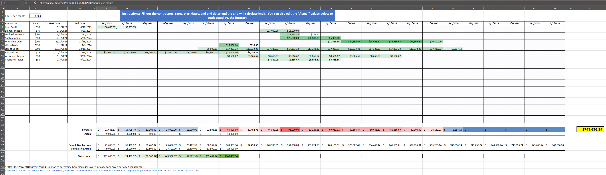

# Excel Contractor Roster Example

## Table of Contents

- [About](#about)
- [Example](#example)

## About 

Uses the [PercentOfCurrentPeriod](https://gist.github.com/densom/011ce175522c2edbcce680adaf466968) function to calculate the percentage of current period.  Useful for tracking monthly progress of contractor spend.
This worksheet makes it easy to calculate the percentage of current period spend for each contractor by only having to maintain the rate, start date, and end date for each contractor.

## Example 

